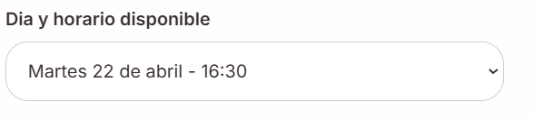

# 2 vista del home cliente:

## campos actuales 
    
- id_curso 
- nombre_curso 
- curso_academico 
- id_admin 

## campos necesarios devueltos por la api

- id_curso
- nombre_curso
- curso_academico
- descripcion  /  agregar  tipo varchar 
- icono        / agregar   tipo varchar
- id_admin 

tareas: 
Actualizar la tabla en a base de datos
actualizar las entidades en la api
verificar la respuesta de la api

# 2 vista de talleres cliente:

## campos actuales 
    
- id_taller 
- nombre_taller
- duracion_minutos 
- tipo_taller 
- capacidad_maxima 
- id_curso 

## campos necesarios devueltos por la api

- id_taller 
- nombre_taller
- duracion_minutos 
- tipo_taller 
- capacidad_maxima 
- descripcion  /  agregar  tipo varchar 
- icono        / agregar   tipo varchar
- id_curso 

tareas: 
Actualizar la tabla en a base de datos
actualizar las entidades en la api
verificar la respuesta de la api

# 3.1 vista de fomulario cliente

ruta para traer los horarios de un taller especifico
- la ruta debe tomar el id de un taller y retornar sus horarios

## campos actuales

    id_horario 
    dia_semana 
    hora_apertura
    hora_cierre  -- verifica si es necesario el campo hora cierre
    id_taller 

ya que solo tenemos el dia de la semana, implementar logica para saber que numero es el 
proximo dia indicado

# 3.2 vista de fomulario cliente

ruta para crea una cita

## datos enviados por el from

- name
- email
- taller_id: initialWorkshopId,
- horario_id
- allergies

## tabla creada

    id_cita 
    fecha 
    hora 
    estado  -- default pendiente
    id_cliente 
    id_taller 
    id_alumno 

# 4 vista de home profesores

crear ruta para obtener todos los cursos de un profesor

# 5.1 vista de citas profesores

crear ruta para obtener toda las citas de un cursos

# 5.2 vista de citas profesores

crear ruta para actualizar una cita (esta sera para los cambios de estados "pendiente", "confirmada", "completada" y cancelada)
